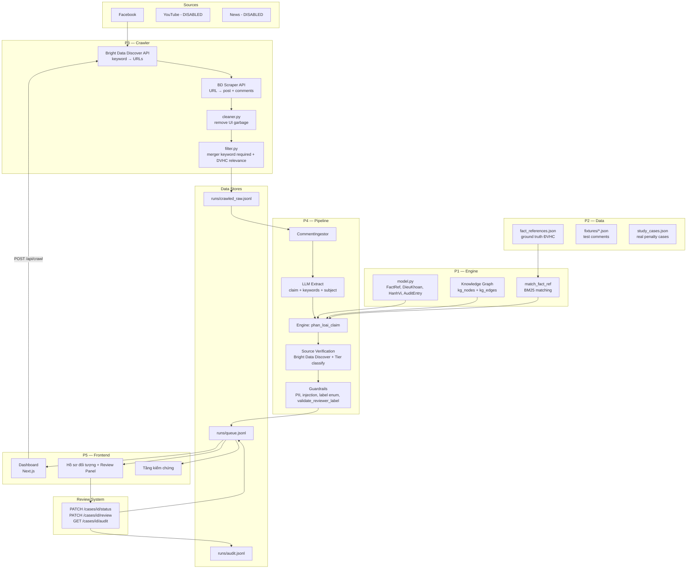
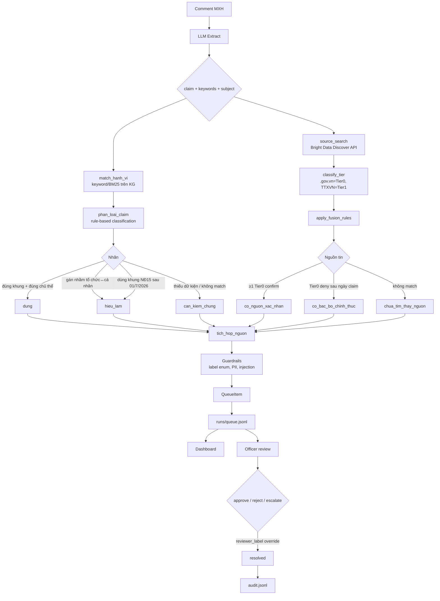
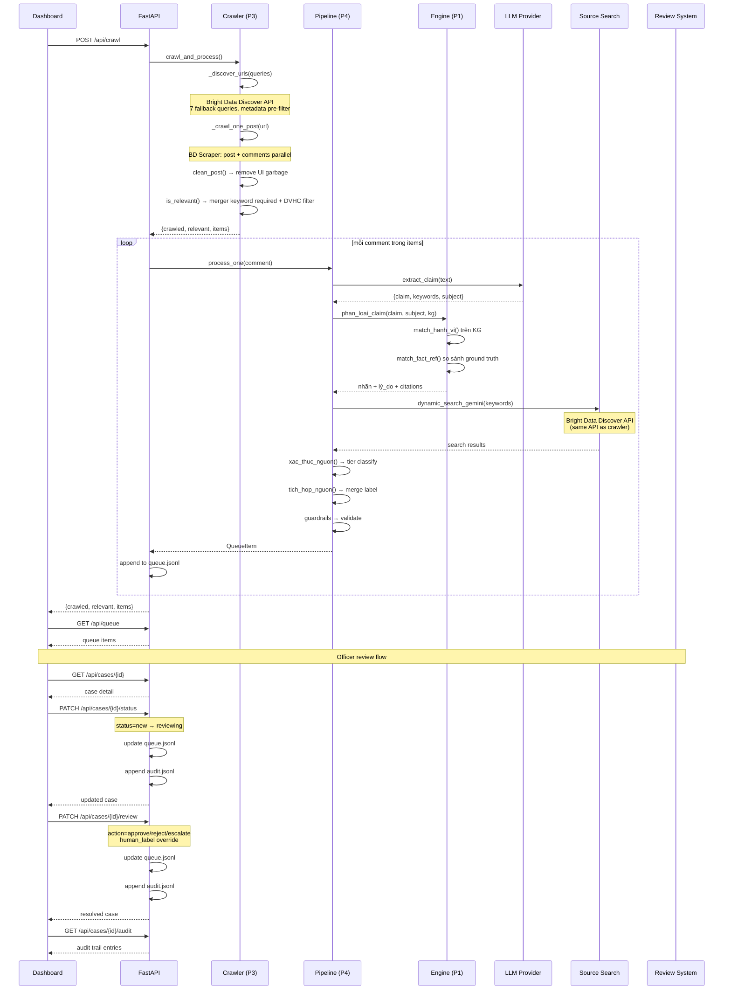
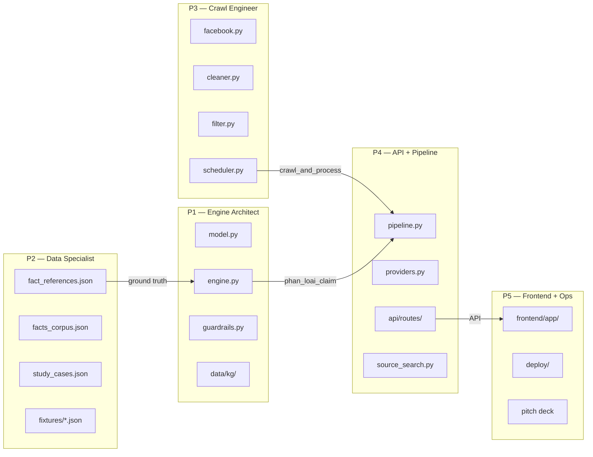

# Địa Chứng

Hệ thống giám sát tin đồn sáp nhập đơn vị hành chính (ĐVHC) trên mạng xã hội. Sử dụng RAG + Knowledge Graph để phân loại phát ngôn thành **đúng** / **hiểu lầm** / **cần kiểm chứng**, phục vụ cán bộ nhà nước ra quyết định xử phạt.

## Kiến trúc tổng thể



## Pipeline E2E



## Luồng dữ liệu chi tiết



## Team ownership



## Stack

| Layer | Tech | Mô tả |
|---|---|---|
| Frontend | Vinext, React, TypeScript | Dashboard giám sát, hồ sơ đối tượng, tầng kiểm chứng |
| Backend API | FastAPI, Python 3.11+ | REST API: queue, cases, review, verify, crawl, qa |
| Engine | Python (pure functions) | Rule-based classification + FactRef matching + BM25 |
| Pipeline | Python | LLM extract → engine → source verification → queue |
| Crawler | Bright Data Discover + Scraper API | Keyword search → FB post URLs → scrape content + comments |
| Source Search | Bright Data Discover API | Dynamic source verification (same API as crawler) |
| Data | JSON (KG, facts, fixtures) | Knowledge Graph NĐ 174, ground truth, study cases |

## Cấu trúc thư mục

```
backend/legal_radar/
├── model.py              # Data model: VanBan, DieuKhoan, HanhVi, QueueItem, AuditEntry, FactRef
├── engine.py             # Classification engine: phan_loai_claim(), match_fact_ref()
├── pipeline.py           # CommentIngestor: LLM extract → engine → queue
├── providers.py          # LLM providers: Gemini, Groq, OpenRouter
├── source_search.py      # Dynamic source search (Bright Data Discover API)
├── source_classifier.py  # Tier classification: .gov.vn, TTXVN, báo lớn
├── guardrails.py         # Label enum, PII scan, injection defense, validate_reviewer_label()
├── vn_normalize.py       # Vietnamese text normalization
├── settings.py           # Environment config (API keys, etc.)
├── paths.py              # Path helpers (runs_dir, data_dir, repo_root)
├── api/
│   ├── main.py           # FastAPI app + CORS
│   ├── dependencies.py   # Shared deps (runs_dir, data_dir)
│   ├── schemas.py        # Pydantic schemas: QueueItemResponse, AuditEntryResponse, ReviewRequest, etc.
│   ├── data_access.py    # JSONL read/write: list_queue_items, update_queue_item_status, get_audit_log
│   └── routes/
│       ├── queue.py      # GET /queue, PATCH /cases/{id}/status, PATCH /cases/{id}/review, GET /cases/{id}/audit, DELETE /queue
│       ├── cases.py      # GET /cases/{id}
│       ├── crawl.py      # POST /crawl (SSE stream), GET /crawl/debug
│       ├── verify.py     # GET /verify
│       └── qa.py         # POST /qa
└── crawlers/
    ├── facebook.py       # Bright Data Discover + Scraper API (7 fallback queries, metadata pre-filter)
    ├── cleaner.py        # Content cleaner: remove UI garbage
    ├── filter.py         # DVHC relevance filter (merger keyword required + ≥2 total matches)
    ├── scheduler.py      # crawl_and_process(): crawl → clean → filter
    ├── youtube.py        # YouTube Data API v3 (DISABLED)
    └── news.py           # Vietnamese news RSS crawler (DISABLED)

frontend/
├── app/
│   ├── page.tsx              # Dashboard: Market Overview (charts, KPI, heatmap)
│   ├── queue/page.tsx        # Hàng đợi giám sát (queue table)
│   ├── reports/page.tsx      # Báo cáo tổng hợp
│   ├── verify/page.tsx       # Tầng kiểm chứng (study cases)
│   ├── sources/page.tsx      # Nguồn tin
│   └── layout.tsx            # Sidebar + Topbar layout
├── components/
│   ├── cases/case-detail.tsx # Hồ sơ chi tiết + Review Panel + Audit Timeline
│   ├── queue/queue-view.tsx  # Queue table with filters
│   ├── dashboard/market-overview.tsx  # Charts, heatmaps, KPI cards
│   └── common/               # Sidebar, Topbar, Badges
├── hooks/use-queries.ts      # React Query hooks: useQueueQuery, useUpdateStatusMutation, useAuditQuery
├── types/index.ts            # Case, ApiQueueItem, AuditEntry, StudyCase
└── utils/
    ├── api.ts                # mapApiCase(), fetchQueue(), reviewCase()
    ├── date.ts               # parseCaseDate()
    └── topic.ts              # discussionTopicName(), legalTopicName()

data/
├── kg/                       # Knowledge Graph
│   ├── kg_nodes.json         # VanBan, DieuKhoan, HanhVi, ChuThe, MucPhat
│   └── kg_edges.json         # QUY_DINH_TAI, THAY_THE
├── facts/
│   ├── fact_references.json  # Ground truth FactRef entries
│   └── facts_corpus.json     # Knowledge base (merger topics only)
├── fixtures/                 # Test comments
├── study_cases/              # Real penalty cases
└── legal/                    # Legal source text (NĐ 174)

runs/
├── queue.jsonl               # Queue items (source of truth)
├── audit.jsonl               # Review audit trail (append-only)
└── crawled_raw.jsonl         # Raw crawled posts
```

## Data stores

| File | Format | Ghi chú |
|---|---|---|
| `runs/queue.jsonl` | JSONL | **Source of truth** cho tất cả case. Mỗi lần update sẽ full rewrite. |
| `runs/audit.jsonl` | JSONL | **Append-only** log. Ghi lại mọi thay đổi status, label override, review notes. |
| `runs/crawled_raw.jsonl` | JSONL | Raw crawl output từ Facebook crawler. URL-deduped trước khi ghi. |
| `data/kg/kg_nodes.json` | JSON | Knowledge Graph nodes: VanBan, DieuKhoan, HanhVi, ChuThe, MucPhat. |
| `data/kg/kg_edges.json` | JSON | Knowledge Graph edges: QUY_DINH_TAI, THAY_THE. |
| `data/facts/fact_references.json` | JSON | Ground truth FactRef entries cho BM25 matching. |
| `data/facts/facts_corpus.json` | JSON | Knowledge base (chỉ chứa entries liên quan sáp nhập ĐVHC). |

## API endpoints

| Method | Path | Mô tả |
|---|---|---|
| GET | `/health` | Health check |
| GET | `/api/queue` | Liệt kê tất cả queue items |
| GET | `/api/cases/{case_id}` | Lấy chi tiết một case |
| PATCH | `/api/cases/{case_id}/status` | Cập nhật status (new/reviewing/resolved), reviewer_label, reviewer_reason, reviewer_note |
| PATCH | `/api/cases/{case_id}/review` | Review action: approve/reject/escalate, human_label override, human_source_label |
| GET | `/api/cases/{case_id}/audit` | Lấy audit trail cho một case |
| DELETE | `/api/queue` | Xóa toàn bộ queue |
| POST | `/api/crawl` | Trigger crawl Facebook (SSE stream) |
| GET | `/api/crawl/debug` | Debug endpoint: test Bright Data APIs |
| GET | `/api/verify` | Lấy study cases cho tầng kiểm chứng |
| POST | `/api/qa` | Phân tích một comment đơn lẻ |

## Human-in-the-loop (Review workflow)

Hệ thống hỗ trợ cán bộ nhà nước review và override kết quả phân loại của AI:

**Luồng review:**
1. Case được tạo với `status=new` từ pipeline
2. Officer mở case → chuyển `status=reviewing` (PATCH /cases/{id}/status)
3. Officer review nhãn AI, có thể override bằng `reviewer_label`
4. Officer resolve case → `status=resolved`

**Label override:**
- Officer có thể ghi đè nhãn AI (`dung` / `hieu_lam` / `can_kiem_chung`) bằng `reviewer_label`
- Khi set `reviewer_label`, status tự động chuyển thành `resolved`
- Validate qua `guardrails.validate_reviewer_label()`

**Review actions** (PATCH /cases/{id}/review):
- `approve` — đồng ý với nhãn AI
- `reject` — từ chối, cần xem xét lại
- `escalate` — chuyển cấp trên xử lý

**Audit trail:**
- Mọi thay đổi status, label override, review action đều được ghi vào `runs/audit.jsonl`
- Mỗi entry gồm: case_id, action, actor, old_value, new_value, note, timestamp
- Append-only, không bao giờ xóa hoặc sửa

## Chạy backend

```powershell
cd backend
python -m pip install -e ".[dev]"
uvicorn backend.legal_radar.api.main:app --reload
```

## Chạy frontend

```powershell
cd frontend
npm install
npm run dev
```

## Chạy crawler

```powershell
# Set Bright Data API key
$env:BRIGHTDATA_API_KEY = "your-key"

# Crawl posts về ĐVHC (Facebook only — YouTube/News disabled)
python run_facebook_crawler.py
# Output: runs/crawled_raw.jsonl
```

Thiết lập crawler: xem [`docs/CRAWLERS_SETUP.md`](docs/CRAWLERS_SETUP.md).

## Chạy tests

```powershell
cd backend
pytest tests/ -v
```

## Team (5 người)

| ID | Vai trò | Sở hữu chính |
|---|---|---|
| P1 | Engine Architect | model.py, engine.py, KG data |
| P2 | Data Specialist | fact_references, fixtures, study_cases |
| P3 | Crawl Engineer | crawlers/, cleaner, filter, keywords |
| P4 | API + Pipeline | api/, pipeline.py, providers.py |
| P5 | Frontend + Ops | frontend/, deploy, pitch |

## CI

GitHub Actions chạy trên mỗi push:
- `ruff check` — lint
- `pytest` — unit tests
- business evaluation 14 ca kiểm thử
- frontend TypeScript, ESLint, production build, server-render tests và Playwright E2E

## Vận hành an toàn

Production phải đặt `APP_ENV=production`, `ADMIN_API_KEY` và giới hạn `FRONTEND_ORIGIN`. Các API thay đổi dữ liệu quản trị dùng header `X-Admin-Key`; nếu production thiếu key, hệ thống từ chối thao tác. Xem [SECURITY.md](SECURITY.md) và [kế hoạch đánh giá/pilot](docs/EVALUATION_AND_PILOT.md).
