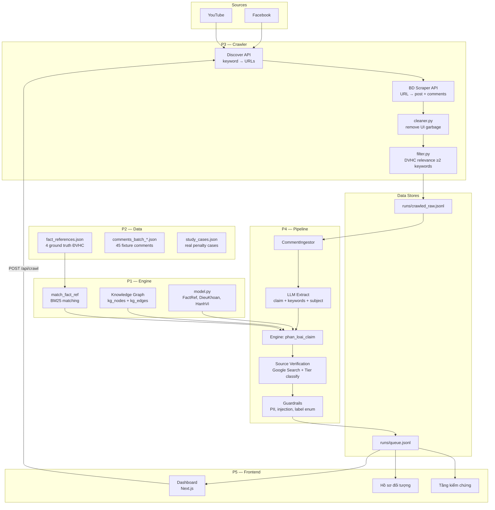
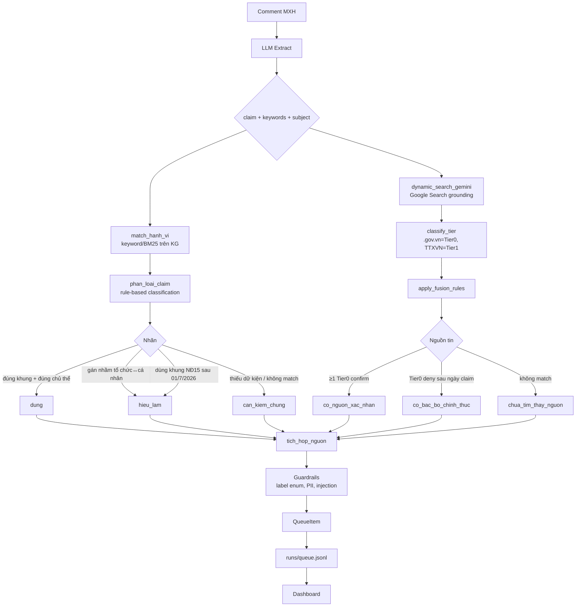
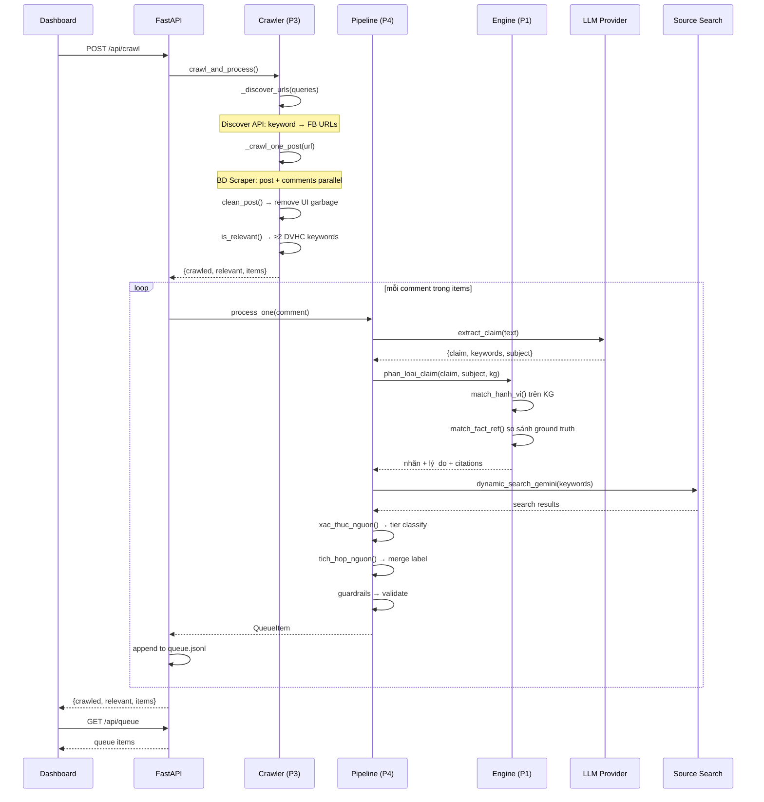
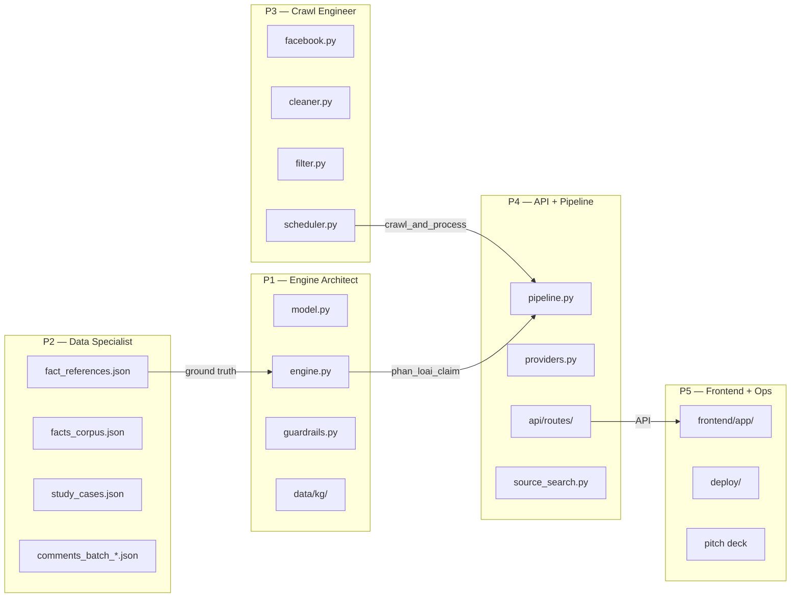

# Địa chứng

Hệ thống giám sát tin đồn sáp nhập đơn vị hành chính (ĐVHC) trên mạng xã hội. Sử dụng RAG + Knowledge Graph để phân loại phát ngôn thành **đúng** / **hiểu lầm** / **cần kiểm chứng**, phục vụ cán bộ nhà nước ra quyết định xử phạt.

## Kiến trúc tổng thể



## Pipeline E2E



## Luồng dữ liệu chi tiết



## Team ownership



## Stack

| Layer | Tech | Mô tả |
|---|---|---|
| Frontend | Next.js, TypeScript | Dashboard giám sát, hồ sơ đối tượng, tầng kiểm chứng |
| Backend API | FastAPI, Python 3.11+ | REST API: queue, cases, verify, crawl, qa |
| Engine | Python (pure functions) | Rule-based classification + FactRef matching + BM25 |
| Pipeline | Python | LLM extract → engine → source verification → queue |
| Crawler | Bright Data Discover + Scraper API | Keyword search → FB post URLs → scrape content + comments |
| Data | JSON (KG, facts, fixtures) | Knowledge Graph NĐ 174, ground truth, study cases |

## Cấu trúc thư mục

```
backend/legal_radar/
├── model.py              # Data model: VanBan, DieuKhoan, HanhVi, QueueItem, FactRef
├── engine.py             # Classification engine: phan_loai_claim(), match_fact_ref()
├── pipeline.py           # CommentIngestor: LLM extract → engine → queue
├── providers.py          # LLM providers: Gemini, Groq, OpenRouter
├── source_search.py      # Dynamic source search (Gemini + Google Search grounding)
├── source_classifier.py  # Tier classification: .gov.vn, TTXVN, báo lớn
├── guardrails.py         # Label enum, PII scan, injection defense
├── vn_normalize.py       # Vietnamese text normalization
├── api/                  # FastAPI routes
│   ├── main.py           # App entry + CORS
│   ├── routes/queue.py   # GET /api/queue
│   ├── routes/cases.py   # GET /api/cases/{id}
│   ├── routes/verify.py  # GET /api/verify
│   └── routes/qa.py      # POST /api/qa
└── crawlers/             # Social media crawlers (P3)
    ├── facebook.py       # Bright Data Discover + Scraper API
    ├── cleaner.py        # Content cleaner: remove UI garbage
    ├── filter.py         # DVHC relevance filter (≥2 keyword match)
    ├── scheduler.py      # crawl_and_process(): crawl → clean → filter
    └── youtube.py        # YouTube Data API v3

data/
├── kg/                   # Knowledge Graph (frozen)
│   ├── kg_nodes.json     # VanBan, DieuKhoan, HanhVi, ChuThe, MucPhat
│   └── kg_edges.json     # QUY_DINH_TAI, THAY_THE
├── facts/                # Ground truth (P2)
│   ├── fact_references.json   # 4 FactRef: NQ QH, Bộ Nội vụ, UBND Thanh Hóa
│   └── facts_corpus.json      # Knowledge base
├── fixtures/             # Test data
│   └── comments_batch_*.json  # 45 mock comments (3 batches)
├── study_cases/          # Real penalty cases
└── legal/                # Legal source text (NĐ 174 trích)

runs/
├── crawled_raw.jsonl     # Raw crawled posts (P3 writes)
├── queue.jsonl           # Processed queue items (P4 writes)
└── reports/              # Generated reports

frontend/app/
├── page.tsx              # Dashboard chính: hàng đợi giám sát
├── cases/[id]/           # Hồ sơ đối tượng + panel nguồn tin
├── verify/               # Tầng kiểm chứng
├── mock-data.ts          # Fallback data
├── types.ts              # Claim, Alert, Verdict types
└── components/           # UI components
```

## Chạy backend

```powershell
cd backend
python -m pip install -e ".[dev]"
uvicorn backend.legal_radar.api.main:app --reload
```

## Chạy frontend

```powershell
cd frontend
npm install
npm run dev
```

## Chạy crawler

```powershell
# Set Bright Data API key
$env:BRIGHTDATA_API_KEY = "your-key"

# Crawl 20 posts về ĐVHC
python run_facebook_crawler.py

# Output: runs/crawled_raw.jsonl
```

## Pipeline E2E

Xem diagram Mermaid ở mục "Pipeline E2E" phía trên.

## Chạy tests

```powershell
cd backend
pytest tests/ -v
```

## Team (5 người)

| ID | Vai trò | Sở hữu chính |
|---|---|---|
| P1 | Engine Architect | model.py, engine.py, KG data |
| P2 | Data Specialist | fact_references, fixtures, study_cases |
| P3 | Crawl Engineer | crawlers/, cleaner, filter, keywords |
| P4 | API + Pipeline | api/, pipeline.py, providers.py |
| P5 | Frontend + Ops | frontend/, deploy, pitch |

## CI

GitHub Actions chạy trên mỗi push:
- `ruff check` — lint
- `pytest` — unit tests
- Type checking (nếu có)
